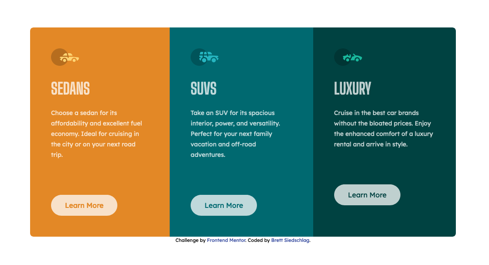

# Frontend Mentor - 3-column preview card component solution

This is a solution to the [3-column preview card component challenge on Frontend Mentor](https://www.frontendmentor.io/challenges/3column-preview-card-component-pH92eAR2-). Frontend Mentor challenges help you improve your coding skills by building realistic projects. 

## Table of contents

- [Overview](#overview)
  - [The challenge](#the-challenge)
  - [Screenshot](#screenshot)
  - [Links](#links)
- [My process](#my-process)
  - [Built with](#built-with)
  - [What I learned](#what-i-learned)
  - [Useful resources](#useful-resources)
- [Author](#author)

## Overview

My goal here is to become fluent in Tailwind CSS. All of my projects will use Tailwind CSS as a framework.

### The challenge

Users should be able to:

- View the optimal layout depending on their device's screen size
- See hover states for interactive elements

### Screenshot

### Links

- Solution URL: [Add solution URL here](https://your-solution-url.com)

## My process

### Built with

- Semantic HTML5 markup
- Tailwind CSS
- Flexbox
- Mobile-first workflow

### What I learned

The main thing I learned is how to use Tailwind CSS in layout. I used the flexbox utility to lay out the mobile and screen view. I also used the rounded corners so that they would switch sides from mobile to screen view. Once I figured out where those utility classes were, I was surprised at how much faster and easier my layout got. I realize that this is a simple project, but I hope to use this knowledge to develop more complecated layouts in the future.

### Useful resources

- [Tailwind CSS](https://tailwindcss.com/) - This was my main resource for installing Tailwind CSS and lookiong up utility classes.

## Author

- Frontend Mentor - [@BrettSiedschlag](https://www.frontendmentor.io/profile/BrettSiedschlag)
- Twitter - [@BrettSiedschlag](https://www.twitter.com/BrettSiedschlag)
